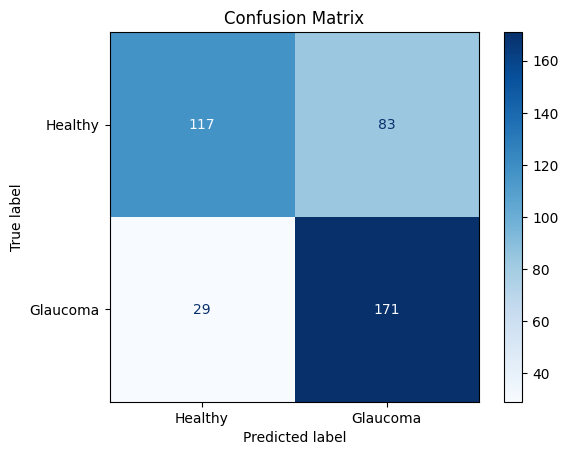
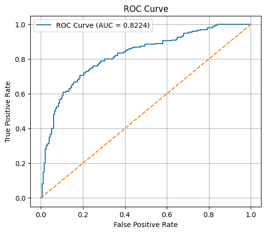
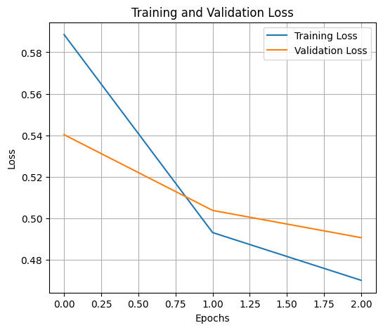
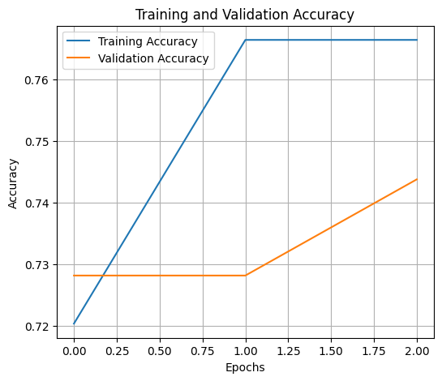

# Glaucoma Detection using Deep Learning (VGG16)

## Overview
This project presents a deep learning-based approach for automatic glaucoma detection using retinal fundus images. Glaucoma is a leading cause of irreversible blindness, and early detection is critical for preventing vision loss.

The system applies a Convolutional Neural Network (CNN) using the VGG16 architecture to classify retinal images into two categories: Healthy and Glaucoma.

---

## Model Architecture
The model is based on transfer learning using VGG16:

- Pretrained VGG16 (ImageNet weights)
- Global Average Pooling layer
- Fully connected (Dense) layers with ReLU activation
- Dropout layer for regularization
- Sigmoid activation for binary classification

---

## Dataset
- Dataset: Standardized Multi-Channel Glaucoma Dataset (SMDG-19)
- Total images: 12,000+
- Image type: Fundus retinal images

### Class Labels:
- 0 → Healthy
- 1 → Glaucoma

---

## Methodology
1. Load dataset and metadata
2. Preprocess images:
   - Resize to 128×128
   - Normalize pixel values
3. Train-test split
4. Model training using VGG16
5. Evaluation using:
   - Accuracy
   - Precision
   - Recall
   - F1-score
   - ROC Curve
   - Confusion Matrix

---

## Results (Based on Study)

### Test Performance
- Test Loss: 0.9833  
- Test Accuracy: 0.8095  
- Test Precision: 0.8570  
- Test Recall: 0.7640  
- Test AUC: 0.8960  

### Classification Report

| Class     | Precision | Recall | F1-score | Support |
|----------|----------|--------|---------|--------|
| Healthy  | 0.78     | 0.86   | 0.82    | 500    |
| Glaucoma | 0.85     | 0.75   | 0.80    | 500    |
| Accuracy |          |        | 0.81    | 1000   |

---

## Experimental Outputs (Implementation)

### Confusion Matrix

### ROC Curve

### Training and Validation Loss

### Training and Validation Accuracy

---

## Observations
- The model shows strong performance in distinguishing glaucoma cases.
- ROC-AUC indicates good separability between classes.

- ## Contribution
This project was developed as part of a group effort.  
My contribution focused on model implementation, training, and evaluation using VGG16.
- Slight imbalance in recall between classes suggests room for improvement.
- Transfer learning significantly improved convergence speed.

---

## Project Structure
